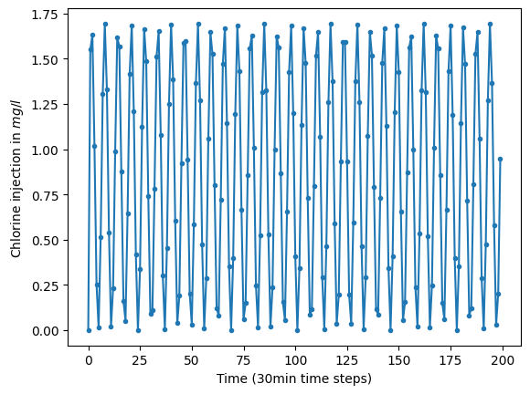

# A Benchmark for Physics-informed Machine Learning of Chlorine States in Water Distribution Networks

This repository contains the benchmark and the implementation of the experiments from the paper [A Benchmark for Physics-informed Machine Learning of Chlorine States in Water Distribution Networks](paper.pdf) by Luca Hermes, André Artelt, Stelios Vrachimis, Marios Polycarpou, and Barbara Hammer.

## Abstract

Ensuring high-quality drinking water is a critical responsibility of water utilities, with chlorine being the main disinfectant typically used. Accurate estimation of chlorine concentrations in the dynamic environment of water distribution networks (WDNs) is essential to ensure safe water supply.
This work introduces a comprehensive benchmark for training and evaluation of chlorine concentration estimation methodologies in WDNs.
The benchmark includes a diverse dataset of 12,000 scenarios from the Net1 and Hanoi networks (two popular WDNs in literature), featuring various chlorine injection patterns to capture diverse physical dynamics.
To provide baseline evaluations, we propose two deep learning models: a physics-informed Graph Neural Network (GNN) and a physics-guided Recurrent Neural Network (RNN). 
Both models are designed for chlorine state estimation and are evaluated against the proposed benchmark using standardized metrics.

## Benchmark for Chlorine State Estimation

### Data Set

This benchmark data set concerns the transport, decay, and mixing of chlorine in water distribution networks (WDNs). It contains two different WDNs, each with 1000 different scenarios (different demand patterns and network parameters) and different Chlorine injection patterns.
The data set was created and simulated by using [EPyT-Flow](https://github.com/WaterFutures/EPyT-Flow).

The data set is based on the [LeakDB data set](https://waterfutures.github.io/WaterBenchmarkHub/benchmarks/KIOS-LeakDB.html) and contains 1,000 scenarios based on [Net1](https://waterfutures.github.io/WaterBenchmarkHub/benchmarks/network-Net1.html) and another 1,000 scenarios based on the [Hanoi network](https://waterfutures.github.io/WaterBenchmarkHub/benchmarks/network-Hanoi.html) -- the demand patterns of those scenarios are the same as in LeakDB and each scenario is 30 days long (30min time steps).

In each scenario, a single chlorine pump (specifying the chlorine concentration of the external inflow) is installed at the reservoir. The chlorine concentration over time is monitored at each node and link (pipe) in the network. Furthermore, the flow rate at each link (pipe) is monitored as well. All bulk and wall reaction coefficients are set to zero — i.e., only the transport, decay, and mixing of chlorine are simulated.
For each scenario, three different Chlorine injection patterns were applied: a spike pattern, a periodic wave-like pattern, and a random pattern -- see Figure below.
<p float="middle">
  
   
  
</p> 
Furthermore, for each case there also exist a scenario where the demand pattern was randomized in order to break any correlation between demand pattern and Chlorine concentration -- see paper for details.

In total, the data set contains 12,0000 scenarios. The data generation process is implemented in [create_data.py](create_data.py).

#### How to load the data set in Python

The data set can be loaded by utilizing the `DataLoader` class. Besides loading the data itself, the `DataLoader` class also provides a method (`load_network_topology()`) for loading the topology of the WDN as an [epyt_flow.topology.NetworkTopology](https://epyt-flow.readthedocs.io/en/stable/epyt_flow.html#epyt_flow.topology.NetworkTopology) instance.

```python
# Load all 1000 Hanoi scenarios with the spike injection pattern
# Goal: Predict Cl concentration at node "2"
d = DataLoader()
X, y = d.load_data_from_scenarios(net_desc="Hanoi",
                                  random_demands=False,
                                  cl_injection_pattern_desc="spike",
                                  target_node_id="2")

# Load the topology of the Hanoi network
hanoi_topology = d.load_network_topology(net_desc="Hanoi")
```

### Evaluation

We propose assessing performance using various metrics. For a single node prediction, denoted as $\hat{y}_i$, this can be extended to multiple nodes by, for example, averaging over all nodes $i$:
- Mean-squared-error (MSE) and the Mean-absolute-error (MAE) as a standardized mean-squared-error metric. These metrics report a single number that allows an easy comparison of different methods/algorithms/solutions/etc.
    
    The MSE is defined as:
    $\frac{1}{T}\sum_{t=1}^{T} \left(\hat{y}_i(t) - y_i(t)\right)^2$

    The MAE is given as:
    $\frac{1}{T}\sum_{t=1}^{T} \left|\hat{y}_i(t) - y_i(t)\right|$
- The running MSE and MAE for evaluating the performance over time -- i.e. determining whether the performance remains stable and robust throughout the duration.

    The running MSE is a function that maps time to performance (i.e. MSE):
    $f(k) = \frac{1}{k}\sum_{t=1}^{k} \left(\hat{y}_i(t) - y_i(t)\right)^2$
    
    Similarly, the running MAE is also a function that maps time to performance (i.e. MAE):
    $f(k) = \frac{1}{k}\sum_{t=1}^{k} \left|\hat{y}_i(t) - y_i(t)\right|$

In addition to averaging scores across all nodes, we recommend comparing scores for each node individually. This approach allows us to assess whether errors and performance are uniformly distributed throughout the WDN or if certain nodes pose greater challenges than others.
For example, a method's performance might be influenced by the node's distance from the reservoir (chlorine injection point) -- i.e. predicting concentrations at nodes located farther away could be more challenging than at nodes closer to the injection site.
One could also group nodes according to their transport delay -- i.e. the time (e.g. time steps) it takes for a substance to travel from the injection point to the node of interest. Note that the transport delay might differ from the spatial distance (e.g. shortest path).

#### How to do the evaluation in Python

The evaluation metrics are implemented in the `Evaluator` class. Besides methods for computing the individual evaluation metrics, there also exist a method `evaluate_predictions()` for computing all evaluation metrics.

```python
# Load test data
X_test, y_test = ....

# Predict Cl states
y_test_pred = ....

# Evaluate predictions using all proposed metrics
print(Evaluator.evaluate_predictions(y_test_pred, y_test))
```

## How to Run the Experiments from the Paper

Make sure to first download the [data set](https://filedn.com/lumBFq2P9S74PNoLPWtzxG4/A-Benchmark-for-Physics-informed-Deep-Learning-of-Chlorine-States-in-Water-Distribution-Networks/data.tar.gz),
unpack it, and put it into "data" in the root directory of this folder.

The experiments regarding the RNN are implemented in [run_exp_rnn.py](run_exp_rnn.py)
(and [experiments_rnn.py](experiments_rnn.py)) -- all configurations can be run by executing the
slurm scripts [run_exp_rnn_net1.job.sbatch](run_exp_rnn_net1.job.sbatch) and
[run_exp_rnn_hanoi.job.sbatch](run_exp_rnn_hanoi.job.sbatch).

The experiments regarding the GNN are implemented in [graph_pde.py](graph_pde.py)
 -- all configurations can be run by executing the
bash script [run_gnn_experiments.sh](run_gnn_experiments.sh).

## License

MIT license - See [LICENSE](LICENSE).

## How to Cite?

```
@misc{machinelearningchlorinestateestimationbenchmark2024,
        author = {Luca Hermes, André Artelt, Stelios G. Vrachimis, Marios M. Polycarpou, Barbara Hammer},
        title = {A Benchmark for Physics-informed Machine Learning of Chlorine States in Water Distribution Networks},
        year = {2024}
    }
```
